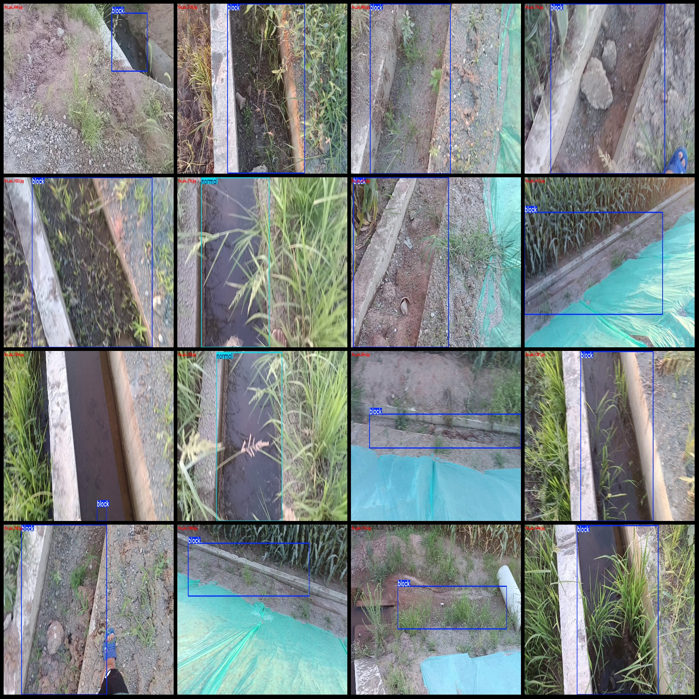
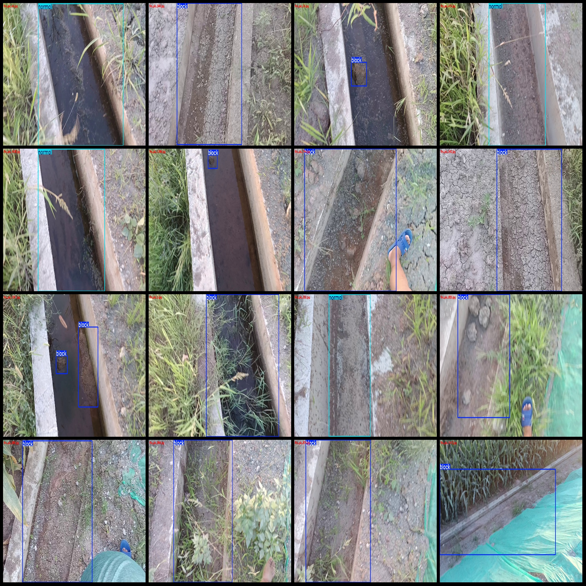

# Drone View Roadside Slope Drainage Channel Blockage and Soil Accumulation Detection Dataset VOC+YOLO Format with 1488 Images in 2 Categories

Dataset format: Pascal VOC format + YOLO format (excluding the split path in txt files, only containing jpg images along with corresponding VOC format xml files and YOLO format txt files)
Number of images (jpg file count): 1488
Number of annotations (xml file count): 1488
Number of annotations (txt file count): 1488
Number of annotation categories: 2
Annotation category names (note that the order of labels in YOLO format does not correspond to this, but is based on the "labels" folder's "classes.txt"): ["block", "normal"]
Number of bounding box instances per category:
- block (blockage/accumulation) instances = 1328
- normal (normal) instances = 295
Total bounding box instances: 1623
Number of images per category:
- block (blockage) images = 1193
- normal (normal) images = 295
Image resolution: 1920x1080
Annotation tool used: labelImg
Drone: DJI MAVIC 3
Collection height: 2-3m
Collection angle: 60~90°
Annotation rules: Draw a rectangle around the class
Important note: The dataset does not include a training/validation/test split; you will need to do this yourself.
Special declaration: This dataset does not guarantee the accuracy of models or weight files trained on it.
Image preview:
Annotation examples:

## Images

Here is a pay link on Stripe ( https://buy.stripe.com/3cs8yP7sY87d0vu9AB ). Please contact me lonlonago@foxmail.com after funding $89, and I will send you a complete data files , thank you!

